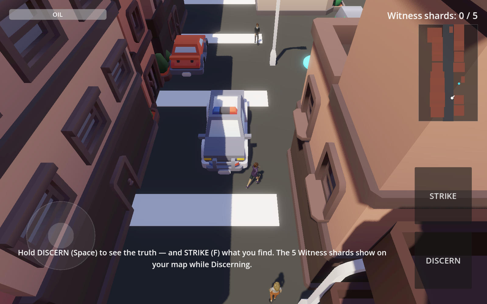
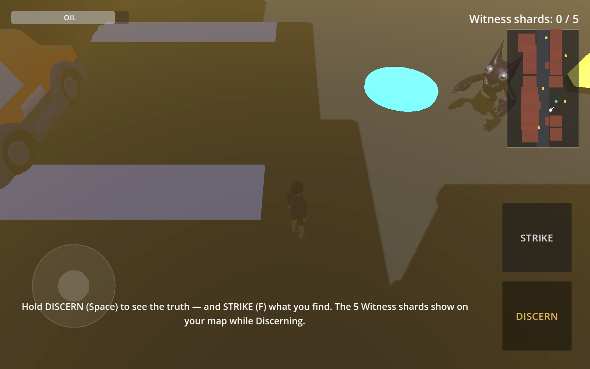
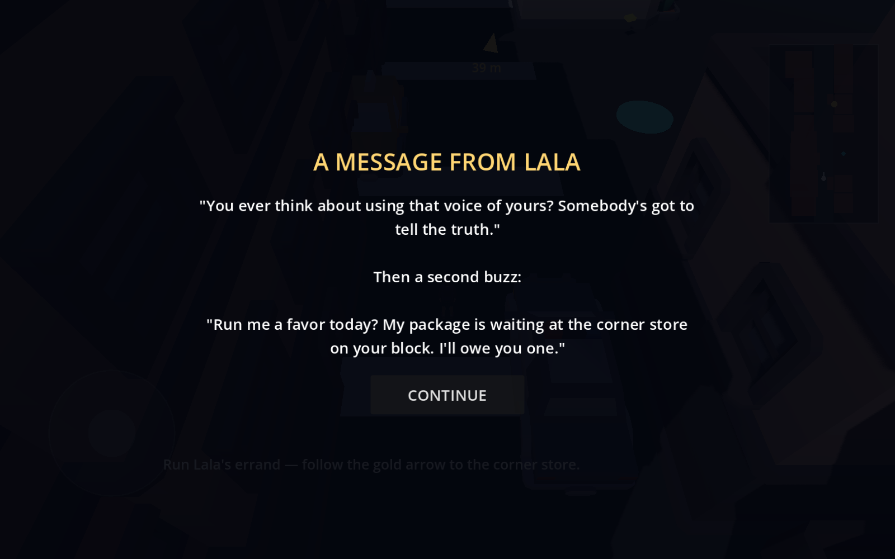

# Truth B Told: The Awakening

Action / adventure / puzzle game for mobile (Godot 4.4, Mobile renderer).

A regular man finds a hidden book in a city alley. When he opens it, the veil
over the world tears — he begins to see the lies, the agents who guard them,
and the spirits behind them. Guided by the Truth B Told family, he walks the
book's chapters through time, gathering knowledge to face the present.

| The street | Discernment | The story |
|---|---|---|
|  |  |  |

## Folder map

| Path | What lives here |
|---|---|
| `docs/GAME_DESIGN.md` | The full design document — story, mechanics, loop, enemies |
| `docs/CUTSCENE_SCRIPTS.md` | Shot-by-shot scripts with Grok-ready prompts for every cutscene |
| `docs/CHARACTERS.md` | Cast roster — the Lead + Truth B Told family cameo slots |
| `docs/ART_STYLE.md` | The four art-direction options and the mobile perf tradeoffs |
| `scenes/` | Godot scenes (`main.tscn` is the entry point) |
| `scripts/` | GDScript |
| `assets/cutscenes/` | Drop converted Grok videos here (see its README for the ffmpeg step) |
| `assets/models/`, `assets/audio/` | 3D models and sound |

## Web build (what Vercel serves)

`web/` holds the exported browser build (WASM); `vercel.json` points Vercel
at it, so every push redeploys the playable game. To rebuild after changes:

```
godot --headless --export-release "Web" web/index.html
```

Test locally with `node web_server.js` → http://localhost:8742. Saves work
in the browser too (Godot maps `user://` to IndexedDB).

## Opening the project

Install Godot 4.4 (standard, not .NET) → Import → select this folder's
`project.godot`. The Mobile renderer and landscape orientation are already set.

## Playing the slice

Open the project in Godot 4.6 and press Play (F5). You're Bro Truth (animated
low-poly placeholder) on a brick-tinted St. Louis block: road, crosswalk,
parked cars, streetlights, a Watcher on the sidewalk, and an alley on the
east side. Walk with WASD (or drag the left half of the screen on touch) and
hold **DISCERN** (Space, or the on-screen button) to see the hidden layer —
the Witness shards and the spirit hanging over the alley. Collect all five;
the glowing study point in the alley refills Oil. Progress autosaves on every
pickup. Preview renders live in `docs/previews/`.

## Next steps

- [x] Art style: stylized low-poly (`docs/ART_STYLE.md`)
- [x] Truth B Told roster — founding five (`docs/CHARACTERS.md`)
- [x] Lead named: Bro Truth
- [x] Slice: movement, Discernment, Oil, shards, touch controls, save system
- [x] Low-poly St. Louis block: Kenney streets + brick-tinted buildings, animated Bro Truth, Watcher NPC, alley spirit
- [x] Part 1 quest arc: Lala's message → errand → the Book (unlocks Discernment) → shard hunt → Watcher chase → safehouse ending ("to be continued")
- [x] Story-card cutscene placeholders (Grok videos drop into the same slots later)
- [ ] First deliverance encounter (stagger → Discern → cast out)
- [ ] Enoch jump trial level
- [ ] Music + sound effects
- [ ] Android export + on-device test
